<h2 align=center>🔥 Held - Dark Theme 🔥</h2>
<p align=center style="font-style: italic">Held theme -> no modification needed, set and go!                                          
</p>

___
</br>
<h2 align=center>🖥 Installation:</h2>

* Open Extensions sidebar panel in VS Code. View → Extensions.
    * Öffne Erweiterungen in der Seitenleiste im VS Code oder unter dem Menüpunkt Anzeige → Erweiterungen.
* Search for Held.
    * Suche nach Held.
* Click Install to install it.
    * Klicke auf installieren.
* Code → Preferences → Color Theme → Held or sidebar → panel → settings icon → Color Theme.
    * Code → Einstellungen → Farbschema → Held. Oder im VS Code auf der Seitenleiste unten auf das Zahnrad → Farbdesign.
* Optional: Use the recommended settings below for the best experience.
    * Optional: Benutze die von mir empfohlenen Einstellungen, siehe unten, um das best mögliche Ergebnis zu erzielen.
</br>

<h2 align=center>🧑‍💻 Usage:</h2>
<p align=center style="font-style: italic">
Select the Theme and happy coding! / Farbschema auswählen und happy coding!
</p>

___
</br>
<h3 align=center>Integrated Terminal:</h3>

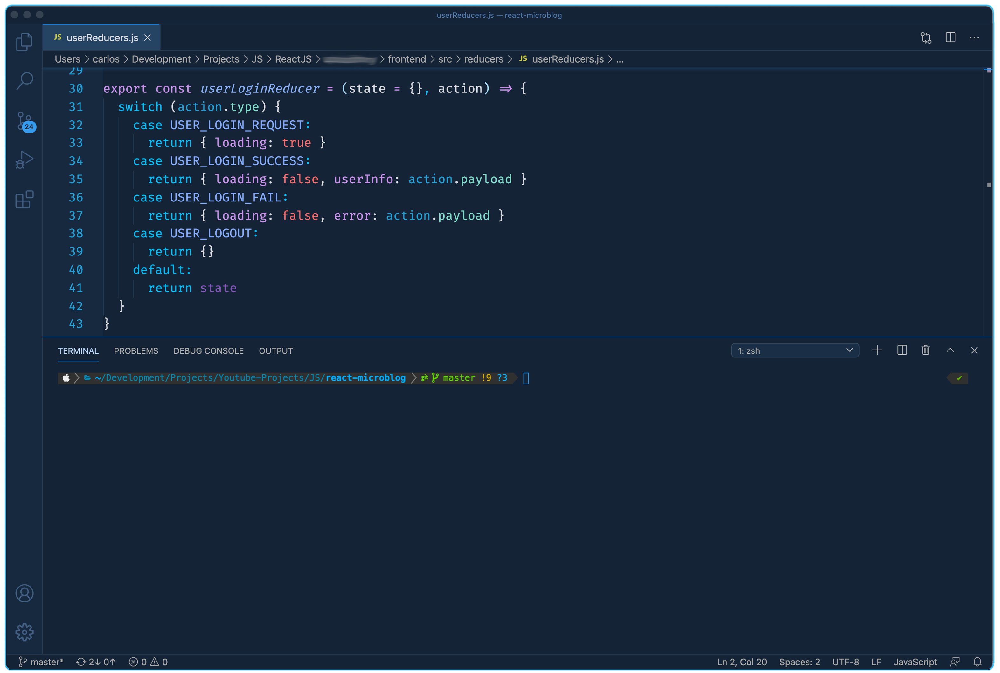
</br>
</br>
<h3 align=center>Windows Side by Side Horizontal:</h3>

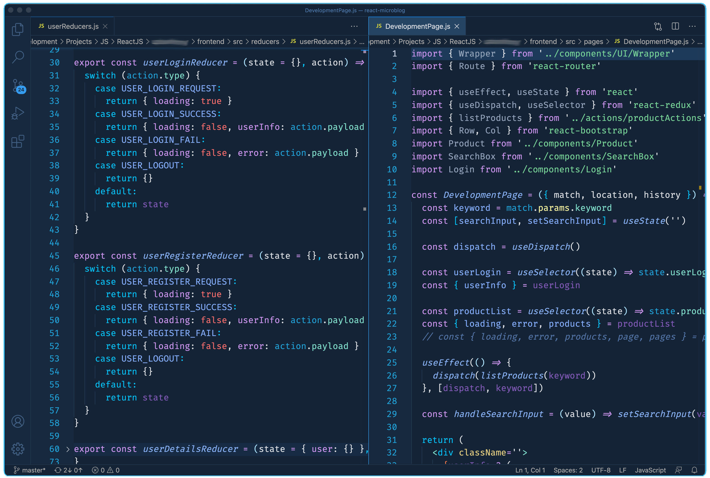
</br>
</br>
<h3 align=center>Windows Side by Side Vertical:</h3>

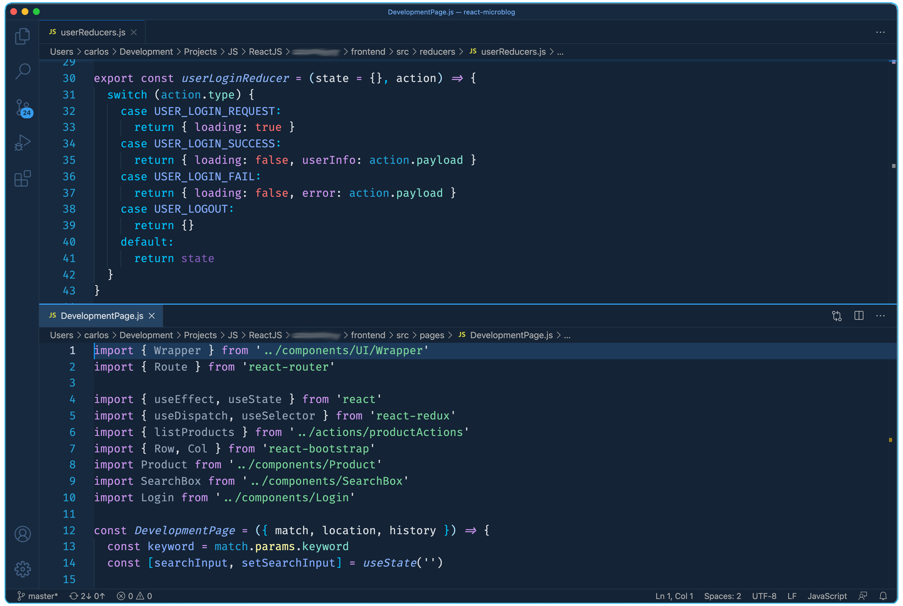
</br>
</br>
<h3 align=center>Side Bar:</h3>

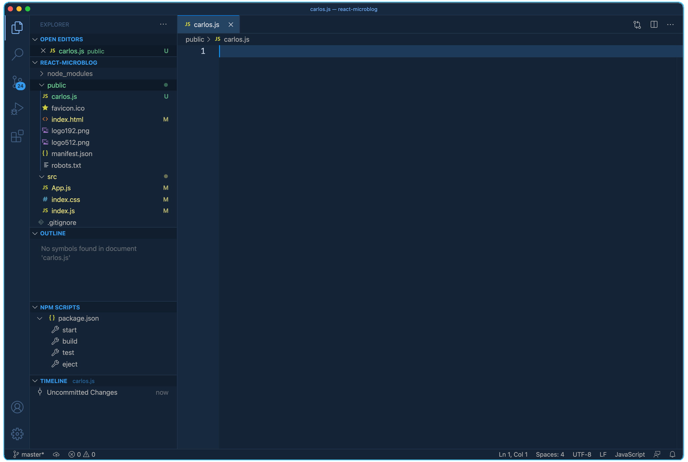
</br>
</br>
<h3 align=center>Menus:</h3>

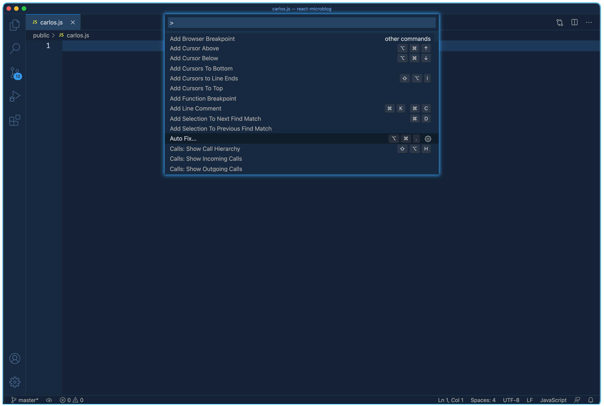
</br>

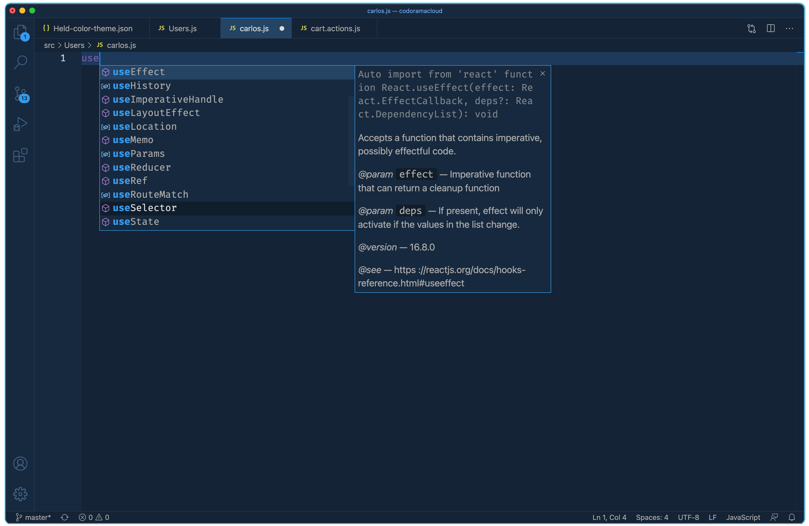
</br>
</br>
<h3 align=center>React Component File:</h3>

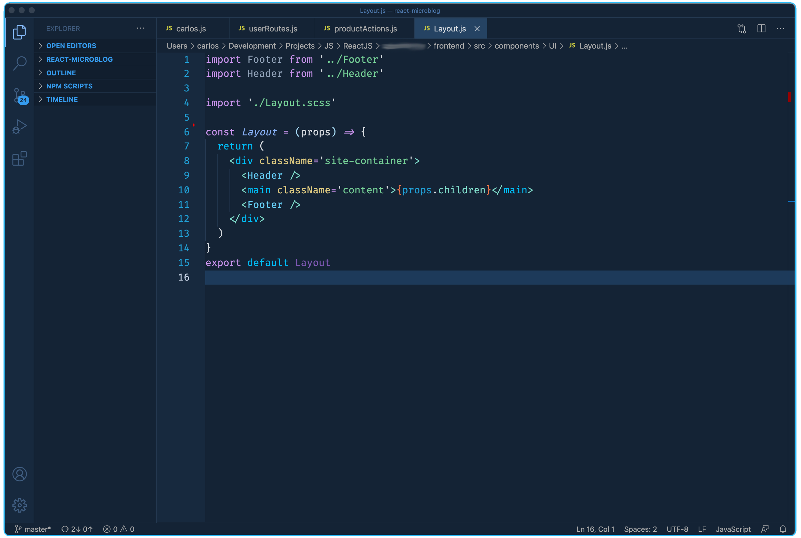
</br>
</br>
<h3 align=center>HTML File:</h3>

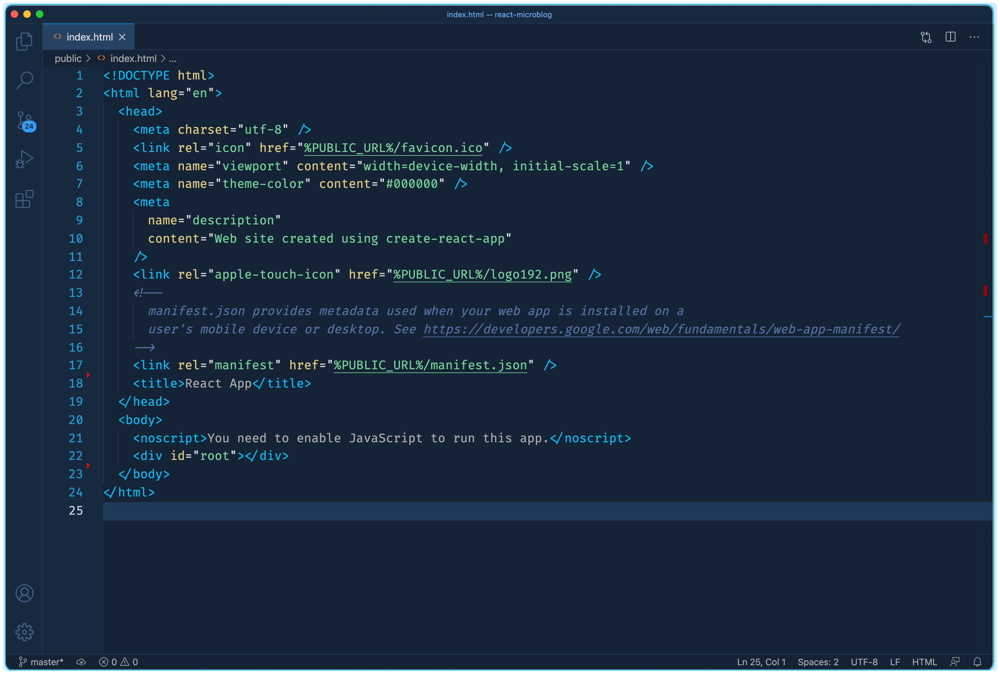
</br>
</br>
<h3 align=center>Python File:</h3>

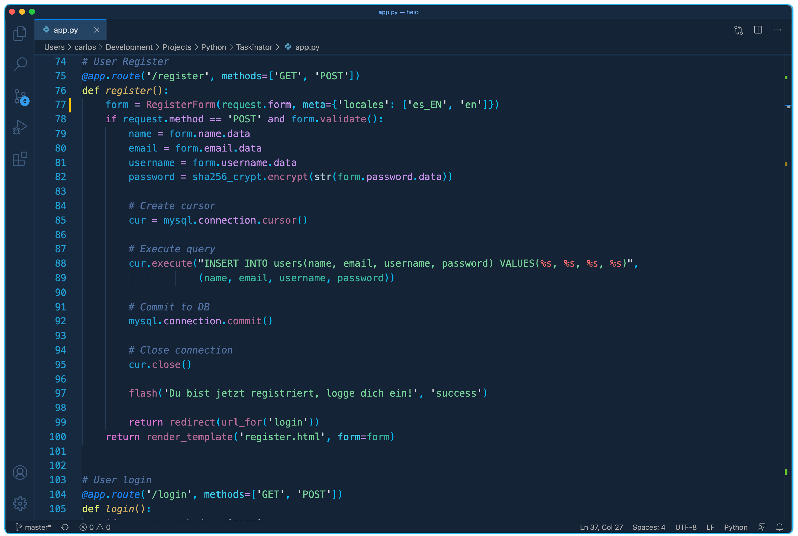
</br>
</br>
<h3 align=center>JavaScript Vanilla File:</h3>

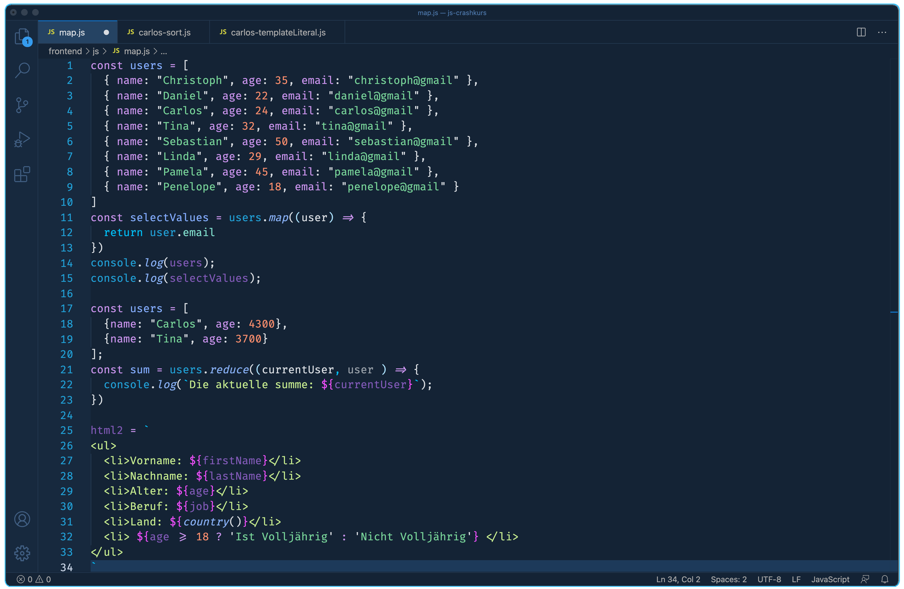
</br>
</br>
<h3 align=center>CSS File:</h3>

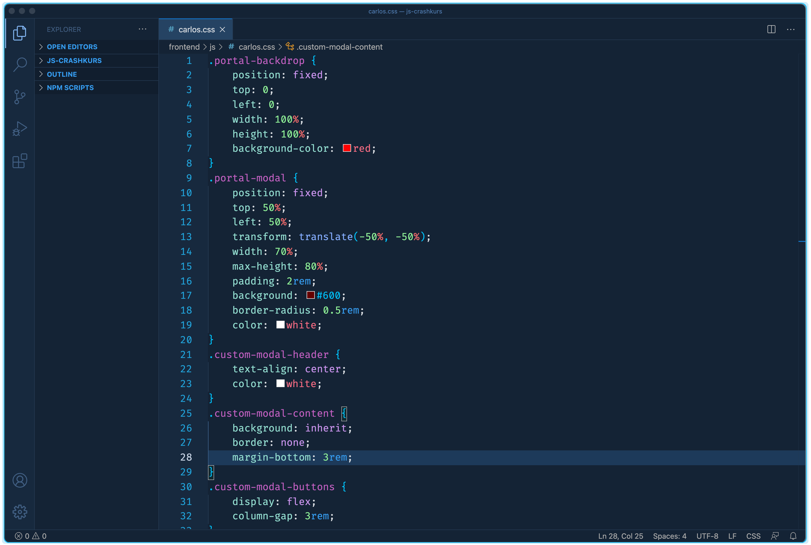
</br>
</br>
<h3 align=center>React JSX File:</h3>

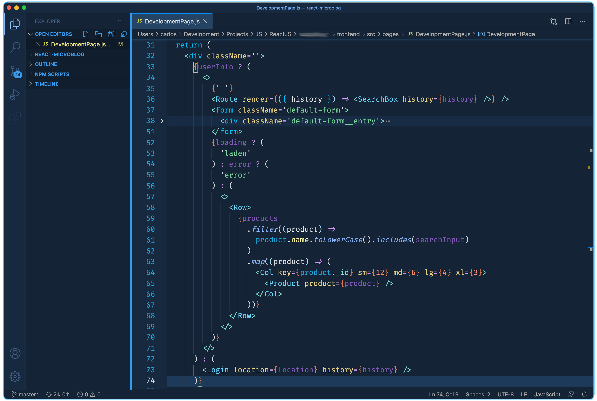
___
</br>

<p align=center>🚀 Recommended Settings: / Empfohlene Einstellungen:</p>

```javascript
{
  "workbench.colorTheme": "Held",
  "editor.fontFamily": "Fira Code, Menlo, Monaco",
  "editor.fontSize": 16,
  "editor.lineHeight": 23,
  "editor.letterSpacing": 0.1,
  "files.trimTrailingWhitespace": true,
  "editor.fontWeight": "400",
  "editor.cursorWidth": 2,
  "editor.cursorBlinking": "solid",
  "editor.renderWhitespace": "none",
}
```
</br>
<p align=center>Thanks: / Danke an:</p>
<p align=center>🌹 A special Thank You to my wife for her awesome support!</p>
<p align=center>🌹 Ein Besonderer Dank an meine liebe Frau für ihre Unterstüzung!</p>

___

</br>

Created by Carlos from:

[Tech with Carlos](https://www.youtube.com/channel/UCWx7qglu2VAnkBj8M_SsRbg/featured)
